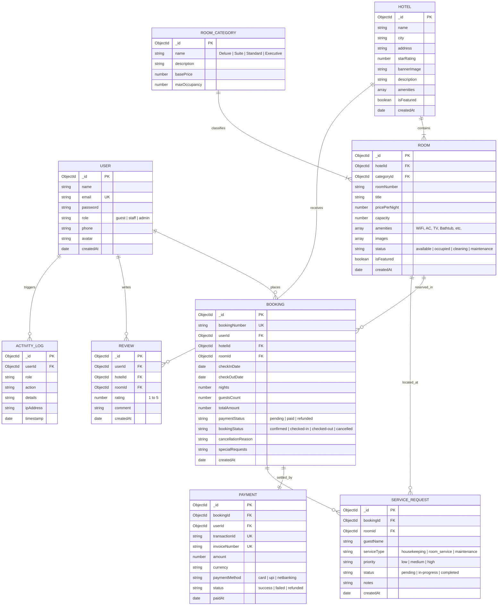

# HotelPro - Entity Relationship (ER) Diagram

This document illustrates the data schema and relational mappings implemented in MongoDB using Mongoose ODM.

```mermaid
erDiagram
    USER ||--o{ BOOKING : "places"
    USER ||--o{ REVIEW : "writes"
    USER ||--o{ ACTIVITY_LOG : "triggers"
    
    HOTEL ||--|{ ROOM : "contains"
    HOTEL ||--o{ REVIEW : "receives"
    
    ROOM_CATEGORY ||--|{ ROOM : "classifies"
    
    ROOM ||--o{ BOOKING : "reserved_in"
    ROOM ||--o{ SERVICE_REQUEST : "located_at"
    
    BOOKING ||--|| PAYMENT : "settled_by"
    BOOKING ||--o{ SERVICE_REQUEST : "initiates"

    USER {
        ObjectId _id PK
        string name
        string email UK
        string password
        string role "guest | staff | admin"
        string phone
        string avatar
        date createdAt
    }

    HOTEL {
        ObjectId _id PK
        string name
        string city
        string address
        number starRating
        string bannerImage
        string description
        array amenities
        boolean isFeatured
        date createdAt
    }

    ROOM_CATEGORY {
        ObjectId _id PK
        string name "Deluxe | Suite | Standard | Executive"
        string description
        number basePrice
        number maxOccupancy
    }

    ROOM {
        ObjectId _id PK
        ObjectId hotelId FK
        ObjectId categoryId FK
        string roomNumber
        string title
        number pricePerNight
        number capacity
        array amenities "WiFi, AC, TV, Bathtub, etc."
        array images
        string status "available | occupied | cleaning | maintenance"
        boolean isFeatured
        date createdAt
    }

    BOOKING {
        ObjectId _id PK
        string bookingNumber UK
        ObjectId userId FK
        ObjectId hotelId FK
        ObjectId roomId FK
        date checkInDate
        date checkOutDate
        number nights
        number guestsCount
        number totalAmount
        string paymentStatus "pending | paid | refunded"
        string bookingStatus "confirmed | checked-in | checked-out | cancelled"
        string cancellationReason
        string specialRequests
        date createdAt
    }

    PAYMENT {
        ObjectId _id PK
        ObjectId bookingId FK
        ObjectId userId FK
        string transactionId UK
        string invoiceNumber UK
        number amount
        string currency
        string paymentMethod "card | upi | netbanking"
        string status "success | failed | refunded"
        date paidAt
    }

    REVIEW {
        ObjectId _id PK
        ObjectId userId FK
        ObjectId hotelId FK
        ObjectId roomId FK
        number rating "1 to 5"
        string comment
        date createdAt
    }

    SERVICE_REQUEST {
        ObjectId _id PK
        ObjectId bookingId FK
        ObjectId roomId FK
        string guestName
        string serviceType "housekeeping | room_service | maintenance"
        string priority "low | medium | high"
        string status "pending | in-progress | completed"
        string notes
        date createdAt
    }

    ACTIVITY_LOG {
        ObjectId _id PK
        ObjectId userId FK
        string role
        string action
        string details
        string ipAddress
        date timestamp
    }
```
